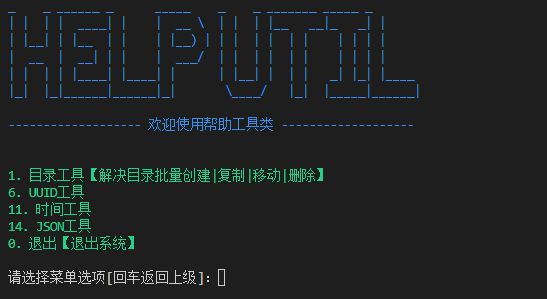
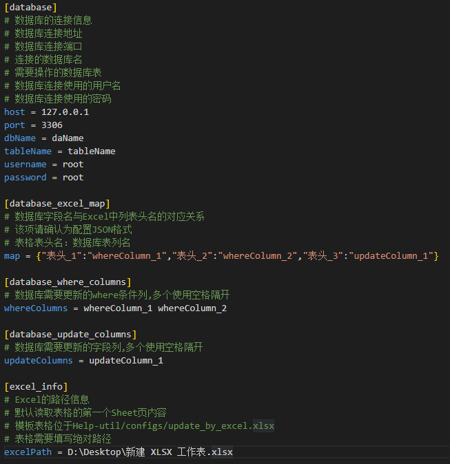

# HelpUtil

## 前言

致力于目录批量操作，节省生产过程中批量操作的时间

## 系统截图



## 目录结构说明

|—commons #公共组件

|—model #模块实体类

|—logs #记录程序运行日志

|—service #功能业务类

|—utils #工具类

|—main.py #程序入口

|—logo.ini #系统LOGO

## 基础环境

### centos7

```shell
yum install python3 -y
pip3 install virtualenv
```
## 运行

### centos7

```shell
mkdir -p /mnt/app && cd /mnt/app
git clone https://github.com/hechunhuis/help-util.git
cd ./help-util
virtualenv --python=python3
source env/bin/activate
pip install -i https://pypi.doubanio.com/simple/ -r requirements.txt
python3 main.py
```


## 二次开发

### 如何自定义系统菜单选项

只需要配置service程序目录的system_service.py中，初始化方法即可

```python
def __init__(self) -> None:
        '''
        初始化菜单信息
        '''
        self.menus.append(MenuModel(1, 0, "目录工具类", "描述", None))
        self.menus.append(MenuModel(2, 1, "提取目录", "描述", None))
        self.menus.append(MenuModel(3, 2, "提取目录子菜单", "描述", DirService.print))
        self.menus.append(MenuModel(0, 0, "退出", "描述", sys.exit))
```

MenuModel结构信息如下：

```python
class MenuModel:
    id = None           # ID主键(不可重复，顶级菜单ID为0)
    parentId = None     # 父ID主键
    name = None         # 功能菜单名称
    description = None  # 功能菜单描述
    method = None       # 功能菜单调用对应的方法

    def __init__(self, id, parentId, name, description, method) -> None:
        self.id = id
        self.parentId = parentId
        self.name = name
        self.description = description
        self.method = method
```

## 功能模块介绍：

### 目录工具

#### 批量删除目录(未开放)【根据规则批量删除目录】

#### 批量移动目录(未开放)【根据规则批量移动目录】

#### 批量复制目录(未开放)【根据规则批量复制目录】

#### 批量创建目录(未开放)【根据规则批量创建目录】

#### 批量前追加目录名称【批量在目录前追加名称】

#### 批量后追加目录名称【批量在目录后追加名称】

#### 批量替换目录名称【批量替换目录名中的字符】

### UUID工具

#### 基于时间戳生成【随机生成UUID】

#### 基于随机数生成【随机生成UUID】

#### 基于名字和MD5散列值生成【随机生成UUID】

#### 基于名字和SAHI值生成【随机生成UUID】

### 时间工具

#### 将时间戳转换为日期格式

#### 将日期转换为时间戳

### 数据库工具

#### 批量设置数据库字段值【根据表格对应关系批量设置】

概述：根据Excel表格，以及配置文件，对数据库字段进行批量修改

Config配置文件【help-util/configs/update_by_excel.ini】:



模板Excel文件【help-util/configs/update_by_excel.xlsx】：


### 退出系统

结束系统程序